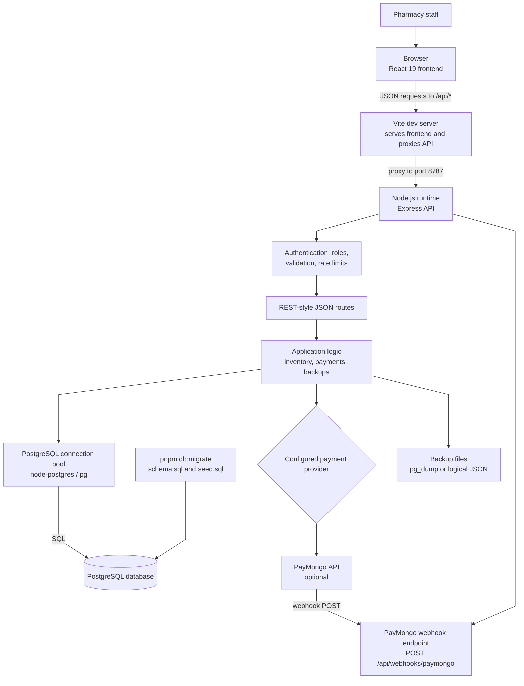
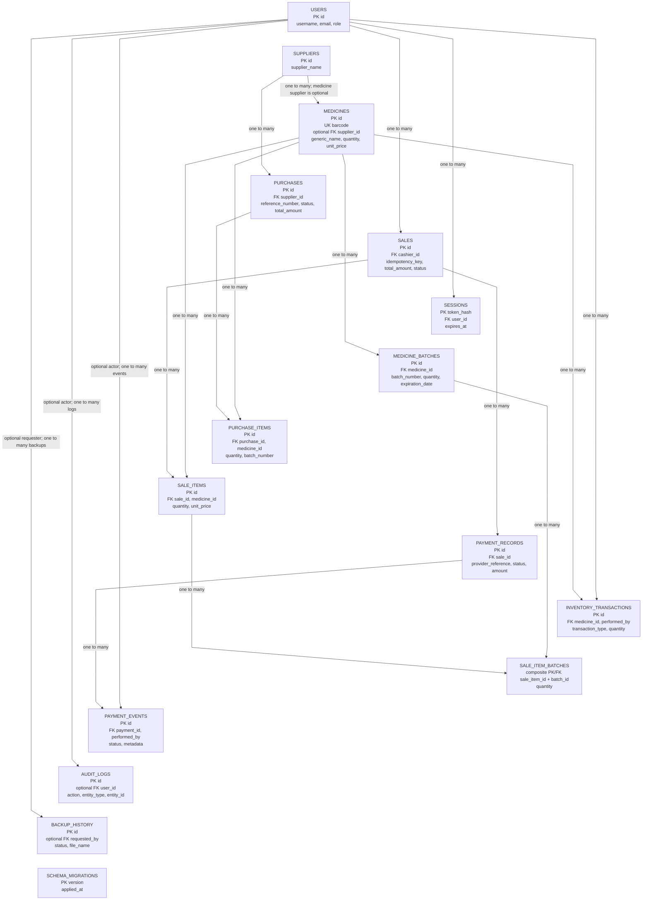

# System Architecture and ERD

## System Architecture



In local development, Vite serves the React frontend and proxies `/api` requests to the Express API. The API returns JSON and uses PostgreSQL through `pg`. `pnpm db:migrate` applies the schema and demo seed data. Payment processing is selected by environment configuration; backups use database backup utilities and files on the API host.

## Entity Relationship Diagram

The diagram shows the database-enforced foreign keys declared in `db/schema.sql`. It is a single top-down diagram with straight connectors. Invisible layout links keep the tables in a vertical sequence; they are not database relationships. Entity fields are representative identifiers and relationship columns, not every column.


```

## Relationship Notes

- A medicine may have no supplier; `medicines.supplier_id` is nullable.
- A sale item can be fulfilled from multiple medicine batches. `sale_item_batches` is the junction table and uses `(sale_item_id, batch_id)` as its composite primary key.
- `inventory_transactions.reference_id` is a text reference without a declared foreign key, so its target depends on the transaction type.
- `purchases.created_by` is stored as text but has no declared foreign-key constraint in the current schema.
- `schema_migrations` records schema versions and has no relationship to the business entities.
